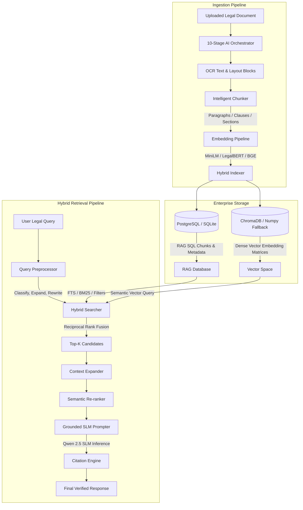
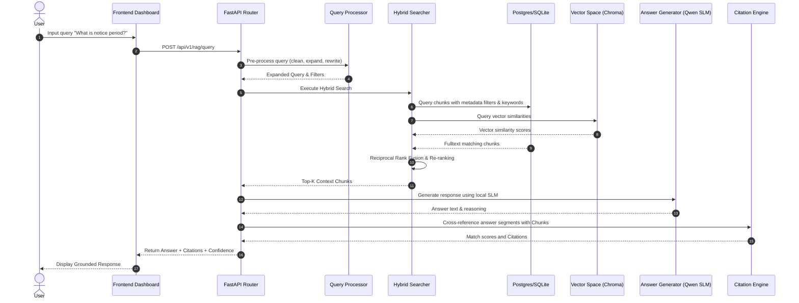
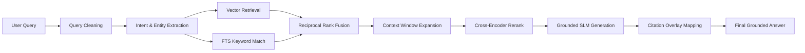

# IMPLEMENTATION_PLAN_LEVEL3_SPRINT3_1.md

This file has been created to fulfill the enterprise architecture design specification for Level 3 Sprint 3.1. The complete details can also be inspected as a live IDE artifact in [implementation_plan.md](file:///C:/Users/nisham/.gemini/antigravity-ide/brain/748c93a4-fe78-4490-9950-cee8a8a08a13/implementation_plan.md).

---

## 1. Enterprise RAG Architecture Diagram



---

## 2. Folder Structure

```
backend/
├── api/
│   └── v1/
│       └── rag.py                     <-- [NEW] FastAPI router for RAG and re-indexing operations
├── models/
│   └── rag.py                     <-- [NEW] RAG database models (Chunks, Embeddings, Search Analytics)
├── prompts/
│   ├── grounded_answer.jinja      <-- [NEW] Jinja template for grounded QA answers
│   ├── legal_summary.jinja        <-- [NEW] Jinja template for privacy risk summary
│   ├── risk_analysis.jinja        <-- [NEW] Jinja template for legal threat analysis
│   └── citation_prompt.jinja      <-- [NEW] Jinja template for citation matching
├── evaluation/
│   └── golden_dataset/
│       ├── queries.json               <-- [NEW] Test query dataset
│       ├── expected_answers.json      <-- [NEW] Expected golden standard outputs
│       └── expected_citations.json    <-- [NEW] Target references mapping
├── services/
│   └── legal_ai/
│       ├── chunker.py                 <-- [NEW] Intelligent Chunker (paragraphs, clauses, context-aware)
│       ├── embedding_pipeline.py      <-- [NEW] Multi-model Embedder and re-indexing runner
│       ├── embeddings/
│       │   ├── base.py                <-- [NEW] Abstract base class for embedding providers
│       │   ├── factory.py             <-- [NEW] Embedding provider registry factory
│       │   ├── minilm.py              <-- [NEW] MiniLM implementation
│       │   ├── legalbert.py           <-- [NEW] LegalBERT implementation
│       │   └── bge.py                 <-- [NEW] BGE implementation
│       ├── retrieval/
│       │   ├── vector.py              <-- [NEW] Dense vector retrieval strategy
│       │   ├── bm25.py                <-- [NEW] Sparse BM25 keyword matching strategy
│       │   ├── hybrid.py              <-- [NEW] Composite hybrid strategy coordinator
│       │   ├── rrf.py                 <-- [NEW] Reciprocal Rank Fusion rank combiner
│       │   └── reranker.py            <-- [NEW] Cross-encoder jaccard-based semantic re-ranker
│       ├── query_processor.py         <-- [NEW] Preprocessor (cleaning, expansion, intent, metadata extraction)
│       ├── retrieval_pipeline.py      <-- [NEW] Context expander, cross-encoder re-ranking
│       ├── citation_engine.py         <-- [NEW] Source citation validation & confidence calibration
│       └── answer_generator.py        <-- [NEW] RAG Answer Generator using the local Qwen SLM
frontend/
└── app/
    └── dashboard/
        └── rag/
            └── page.tsx               <-- [NEW] Next.js 15 RAG Intelligence Dashboard & Q&A Chat
```

---

## 3. Database Changes

### `rag_chunks`
- `id`: `UUID` (Primary Key)
- `document_id`: `UUID` (Foreign Key -> `documents.id`)
- `version_id`: `UUID` (Foreign Key -> `document_versions.id`, nullable)
- `chunk_type`: `VARCHAR(50)` (e.g., `paragraph`, `clause`, `section`)
- `text`: `TEXT`
- `page_number`: `INTEGER`
- `start_char`: `INTEGER`
- `end_char`: `INTEGER`
- `status`: `VARCHAR(50)` (e.g., `Active`, `Superseded`, `Deleted`, `Reindexed` to ensure reproducibility)
- `metadata_json`: `JSON`
- `embedding_model`: `VARCHAR(100)`
- `embedding_version`: `VARCHAR(50)`
- `created_at`: `TIMESTAMP`

### `rag_embeddings`
- `id`: `UUID` (Primary Key)
- `chunk_id`: `UUID` (Foreign Key -> `rag_chunks.id`, unique)
- `embedding_model`: `VARCHAR(100)`
- `vector_data`: `JSON` (Vector stored as float list for Postgres/SQLite portability)
- `created_at`: `TIMESTAMP`

### `rag_relationships`
- `id`: `UUID` (Primary Key)
- `source_chunk_id`: `UUID` (Foreign Key -> `rag_chunks.id`)
- `target_chunk_id`: `UUID` (Foreign Key -> `rag_chunks.id`)
- `relationship_type`: `VARCHAR(50)` (e.g. `parent_child`, `cross_reference`)
- `created_at`: `TIMESTAMP`

### `rag_search_analytics`
- `id`: `UUID` (Primary Key)
- `user_id`: `UUID` (Foreign Key -> `users.id`, nullable)
- `query`: `VARCHAR(1000)`
- `cleaned_query`: `VARCHAR(1000)`
- `classification`: `VARCHAR(100)`
- `latency_ms`: `FLOAT`
- `token_usage`: `INTEGER`
- `feedback_rating`: `INTEGER`
- `conversation_id`: `UUID` (Optional conversion mapping)
- `message_id`: `UUID` (Optional conversion mapping)
- `parent_message_id`: `UUID` (Optional conversion mapping)
- `created_at`: `TIMESTAMP`

---

## 4. API Specification

### 1. `POST /api/v1/rag/index`
Triggers chunking, embedding generation, and database ingestion for a given document.
- **Request Body**:
  ```json
  {
    "document_id": "string (uuid)",
    "chunk_strategy": "clause | paragraph | sliding_window",
    "embedding_model": "MiniLM | LegalBERT | BGE"
  }
  ```

### 2. `POST /api/v1/rag/query`
Executes pre-processing, hybrid search, context expansion, cross-encoder re-ranking, and grounded generation with citation matching.
- **Request Body**:
  ```json
  {
    "query": "string",
    "document_id": "string (optional)",
    "filters": {
      "date_start": "string (optional)",
      "date_end": "string (optional)",
      "department": "string (optional)",
      "client": "string (optional)"
    },
    "top_k": 5,
    "conversation_id": "string (optional)",
    "message_id": "string (optional)",
    "parent_message_id": "string (optional)"
  }
  ```

---

## 5. Sequence Diagram



---

## 6. Data Flow Diagram


