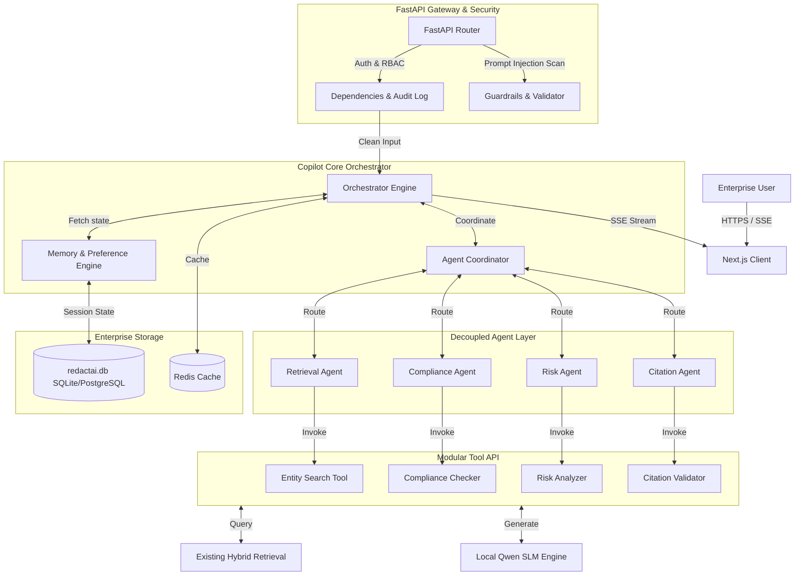
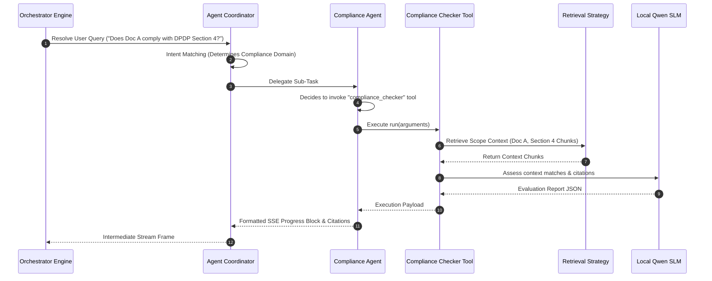

# ENTERPRISE ARCHITECTURE REVIEW & IMPLEMENTATION PLAN
## LEVEL 3 SPRINT 3.2: ENTERPRISE AI LEGAL COPILOT

This document contains the enhanced, production-ready enterprise architecture review and implementation plan for the RedactAI Legal Copilot. It builds on the existing foundations of the platform, maintaining strict backward compatibility with existing RAG indexing, authentication, RBAC, and model registry features.

---

## 1. Executive Summary: Approved vs. Improved vs. New Capabilities

Based on the Sprint 3.2 requirements, the current state of the platform is upgraded from a basic multi-turn chatbot to an **agentic, tool-based, streaming workspace environment**.

### A. Approved Sections (Foundations Maintained)
*   **Existing Authentication & RBAC:** Multi-tenant organization boundaries and JWT token validations remain unchanged and are reused.
*   **Existing RAG & Vector Space:** The sparse-dense hybrid retrieval strategy, embeddings generation (MiniLM, LegalBERT, BGE), and rank fusion (RRF) are reused without modification.
*   **Existing Citation Engine:** The structural matching, validation, and calibration math of citations are kept intact.
*   **Existing Model Registry:** Standard inference endpoints and configurations from prior sprints remain the baseline.

### B. Improved Sections (Enhanced Architecture)
*   **Stateful Conversation Flow:** Upgraded from single-document Q&A to **multi-document scoping**, letting a single chat thread reference a collection of documents (Document Set).
*   **Explainability Model:** Augmented to capture granular diagnostic metrics, including retrieved chunk IDs, ranking scores, prompt template versions, and individual stage latencies.
*   **Prompt Orchestration:** Migrated to a file-based template manager utilizing versioned Jinja templates with security filters, completely divorcing prompt strings from Python files.
*   **Conversation Database Search:** Optimized using indexes and multi-field queries across titles, summaries, entities, and document references.

### C. Newly Added Enterprise Capabilities
*   **Modular Tool-Calling Layer:** A standardized interface enabling the orchestrator to fetch structured outputs from specialized tools (summarization, compliance verification, timelines).
*   **Agent Coordinator Pattern:** An asynchronous orchestration layer coordinating independent LLM sub-agents (Retrieval, Compliance, Risk, Citation) without hardcoding sequential execution.
*   **SSE Streaming Responses:** Non-blocking Server-Sent Events delivering token streaming, typing indicators, intermediate progress events, and partial citations.
*   **AI Workspace System:** A persistent workspace layer separate from chat history for saving pinned answers, generated summaries, compliance reports, and obligations.
*   **Human-in-the-Loop Review Workflow:** Fallback routing to flag low-confidence responses as "Needs Review," enabling reviewers to approve, override, edit, or leave comments.
*   **Performance Optimization & Redis Caching:** Dual-tier caching (Redis + Local Memory) for prompt fragments, embeddings, and context structures.

---

## 2. Enterprise Copilot Architecture

The platform transitions to a decoupled, event-driven pattern. The API gateway receives incoming HTTP/SSE requests, passes them to the Copilot Orchestrator, which utilizes the memory engine to fetch conversation history, triggers agentic coordination, calls the required tools, runs the RAG pipeline, and streams output blocks.



---

## 3. Updated Folder Structure

We introduce modular namespaces under the existing structure. We add `tools/` and `agents/` directories under `legal_ai/`, ensuring clear boundaries and keeping the base RAG classes clean.

```
backend/
├── api/
│   └── v1/
│       └── copilot.py                 <-- [NEW] Router for chat, conversations, summaries, follow-ups
├── models/
│   └── copilot.py                 <-- [NEW] SQL Alchemy schemas for Conversation, Message, and Memory
├── prompts/
│   ├── chat.jinja                 <-- [NEW] Multi-turn conversational prompt with retrieved context
│   ├── summary.jinja              <-- [NEW] Prompt for summarizing chat history
│   ├── risk_analysis.jinja        <-- [NEW] Copilot prompt for legal risk identification
│   ├── clause_explainer.jinja     <-- [NEW] Copilot prompt for explaining specific clauses
│   └── followup.jinja             <-- [NEW] Prompt for generating suggested follow-up questions
├── services/
│   └── legal_ai/
│       ├── agents/                    <-- [NEW] Namespace for decoupled agent structures
│       │   ├── base.py                <-- [NEW] BaseAgent abstract base class
│       │   ├── coordinator.py         <-- [NEW] Orchestrates multi-agent routing
│       │   ├── retrieval.py           <-- [NEW] Scopes retrieval boundaries across documents
│       │   ├── compliance.py          <-- [NEW] Assesses regulatory alignment (DPDP, RBI)
│       │   ├── risk.py                <-- [NEW] Assesses liability and exposure
│       │   └── citation.py            <-- [NEW] Validates source claims
│       ├── tools/                     <-- [NEW] Modular tool layer
│       │   ├── base.py                <-- [NEW] BaseTool standard interface
│       │   ├── clause_explainer.py    <-- [NEW] Jargon simplifier tool
│       │   ├── risk_analyzer.py       <-- [NEW] Risk parser
│       │   ├── summarizer.py          <-- [NEW] Summary generator
│       │   ├── timeline.py            <-- [NEW] Chronological timeline extractor
│       │   ├── entity_search.py       <-- [NEW] Metadata & keyword search tool
│       │   ├── compliance_checker.py  <-- [NEW] Policy compliance validator
│       │   └── citation_validator.py  <-- [NEW] Citation matching verification tool
│       ├── copilot_orchestrator.py    <-- [NEW] Entry point orchestrating agents, SSE parser, and memory
│       ├── memory.py                  <-- [NEW] Short/Long-term state and preference resolver
│       └── prompt_manager.py          <-- [NEW] Prompt loading & caching system
frontend/
├── app/
│   └── dashboard/
│       ├── copilot/
│       │   └── page.tsx               <-- [NEW] Enterprise Legal Copilot UI page (Chat, Sidebar, Search, Citations)
│       └── workspace/
│           └── page.tsx               <-- [NEW] AI Workspace view (pinned responses, reports, saved clauses)
└── services/
    └── copilot.ts                     <-- [NEW] Frontend client for SSE and REST endpoints
```

---

## 4. Updated Database Design

To support multi-document sessions, searching previous runs, workspace storage, and human-in-the-loop audit histories, we introduce five targeted tables.

```
┌────────────────────────────────────────────────────────────────────────┐
│                        Database Entity Schema                          │
├────────────────────────────────────────────────────────────────────────┤
│                                                                        │
│  copilot_conversations                                                 │
│  ├─ id: UUID (PK)                                                      │
│  ├─ user_id: UUID (FK -> users.id)                                     │
│  ├─ title: VARCHAR(255)                                                │
│  ├─ summary: TEXT                                                      │
│  ├─ document_ids: JSON (List of associated Document UUIDs)             │
│  ├─ created_at: TIMESTAMP                                              │
│  └─ updated_at: TIMESTAMP                                              │
│         │                                                              │
│         └───(1:N)───┐                                                  │
│                     ▼                                                  │
│              copilot_messages                                          │
│              ├─ id: UUID (PK)                                          │
│              ├─ conversation_id: UUID (FK -> copilot_conversations.id) │
│              ├─ role: VARCHAR(50)                                      │
│              ├─ content: TEXT                                          │
│              ├─ citations: JSON (Structured list of matching pages)     │
│              ├─ explainability: JSON (Chunk IDs, latency, models)      │
│              └─ created_at: TIMESTAMP                                  │
│                                                                        │
│  copilot_memories                                                      │
│  ├─ id: UUID (PK)                                                      │
│  ├─ user_id: UUID (FK -> users.id, Unique)                             │
│  ├─ short_term_context: JSON                                           │
│  ├─ preferences: JSON (Target laws, tone choice)                       │
│  └─ updated_at: TIMESTAMP                                              │
│                                                                        │
│  copilot_workspace_items                                               │
│  ├─ id: UUID (PK)                                                      │
│  ├─ user_id: UUID (FK -> users.id)                                     │
│  ├─ item_type: VARCHAR(50) (e.g. pinned_clause, obligation, summary)   │
│  ├─ title: VARCHAR(255)                                                │
│  ├─ content: TEXT                                                      │
│  ├─ metadata_json: JSON (Source doc title, page, citations, date)      │
│  └─ created_at: TIMESTAMP                                              │
│                                                                        │
│  copilot_human_reviews                                                 │
│  ├─ id: UUID (PK)                                                      │
│  ├─ message_id: UUID (FK -> copilot_messages.id)                       │
│  ├─ reviewer_id: UUID (FK -> users.id)                                 │
│  ├─ original_answer: TEXT                                              │
│  ├─ edited_answer: TEXT                                                │
│  ├─ reviewer_comments: TEXT                                            │
│  ├─ status: VARCHAR(50) (PENDING, APPROVED, EDITED, REJECTED)          │
│  └─ reviewed_at: TIMESTAMP                                             │
│                                                                        │
└────────────────────────────────────────────────────────────────────────┘
```

### Table Indexing Strategy for Advanced Search
To resolve search queries efficiently (e.g., matching keywords, entities, and document tags inside past sessions), the following composite indexes will be applied:
1.  **FTS (Full-Text Search) Index:** On `copilot_conversations.title` and `copilot_conversations.summary`.
2.  **FTS Index:** On `copilot_messages.content` for keyword retrieval.
3.  **B-Tree Index:** On `copilot_conversations.user_id` and `copilot_conversations.updated_at` (descending) to serve list lookups fast.

---

## 5. Agent & Tool Calling Architecture

We design decoupled interfaces for the **Tools** and **Agents** layers to allow extension without code churn.

### A. Base Tool Class (`services/legal_ai/tools/base.py`)
```python
import abc
from typing import Dict, Any, List

class BaseTool(abc.ABC):
    """Abstract interface defining standard schemas and execution paradigms for LLM tools."""
    
    @property
    @abc.abstractmethod
    def name(self) -> str:
        """Unique identifier of the tool."""
        pass

    @property
    @abc.abstractmethod
    def description(self) -> str:
        """Detailed documentation explaining when the orchestrator should trigger the tool."""
        pass

    @property
    @abc.abstractmethod
    def parameters_schema(self) -> Dict[str, Any]:
        """JSON-schema definition matching arguments expected by the run method."""
        pass

    @abc.abstractmethod
    def run(self, arguments: Dict[str, Any], context_metadata: Dict[str, Any]) -> Dict[str, Any]:
        """Executes the tool's core legal reasoning logic."""
        pass
```

### B. Base Agent Class (`services/legal_ai/agents/base.py`)
```python
import abc
from typing import Dict, Any, List, Generator

class BaseAgent(abc.ABC):
    """Abstract class for independent sub-agents operating within the Copilot workspace."""

    @property
    @abc.abstractmethod
    def agent_id(self) -> str:
        pass

    @abc.abstractmethod
    def process_task(
        self, 
        task_query: str, 
        history: List[Dict[str, Any]], 
        document_set: List[str], 
        preferences: Dict[str, Any]
    ) -> Generator[Dict[str, Any], None, None]:
        """Runs agent loop, yielding SSE token fragments or progress events."""
        pass
```

### C. Agent Execution & Tool Routing Sequence

The orchestrator maps inputs, routes queries to specialized agents, executes required tools dynamically, and streams outputs.



---

## 6. Streaming Architecture (SSE)

To support real-time token stream integration while preserving backward compatibility for standard REST API endpoints, the backend leverages **FastAPI EventSourceResponse**.

### Stream Frame Protocol (SSE Format)
```
event: progress
data: {"step": "retrieving", "document_ids": ["uuid-1"]}

event: citations
data: {"citations": [{"document_name": "NDA.pdf", "page_number": 2, "confidence": 0.94}]}

event: token
data: {"text": "The"}

event: token
data: {"text": " notice"}

event: explainability
data: {"latency_ms": 110, "model": "Qwen2.5-0.5B-Instruct"}

event: end
data: {"conversation_id": "uuid-chat"}
```

---

## 7. API Specification

We maintain full REST compatibility while exposing the `/stream` endpoints.

### 1. `POST /api/v1/copilot/chat/stream`
Submit message and open Server-Sent Events stream channel.
*   **Request Headers:** `Authorization: Bearer <token>`, `Accept: text/event-stream`
*   **Body:**
    ```json
    {
      "conversation_id": "uuid (optional)",
      "message": "string",
      "document_ids": ["uuid-1", "uuid-2"],
      "filters": {"chunk_type": "clause"}
    }
    ```
*   **Response Content Type:** `text/event-stream`

### 2. `POST /api/v1/copilot/workspace/items`
Pin/Save an obligation, clause, or report in the Workspace.
*   **Request Body:**
    ```json
    {
      "item_type": "pinned_clause | obligation | summary | report",
      "title": "string",
      "content": "string",
      "metadata_json": {
        "document_name": "string",
        "page_number": 1,
        "section": "string",
        "citations": []
      }
    }
    ```
*   **Response:** `WorkspaceItemSchema`

### 3. `GET /api/v1/copilot/workspace/items`
List bookmarked items. Query params: `item_type`, `search_query`.

### 4. `POST /api/v1/copilot/reviews/{message_id}`
Submit a manual override, approval, or rejection of an AI output.
*   **Request Body:**
    ```json
    {
      "reviewer_decision": "APPROVED | EDITED | REJECTED",
      "edited_answer": "string (optional)",
      "reviewer_comments": "string"
    }
    ```
*   **Response:** `{"status": "review_saved"}`

### 5. `GET /api/v1/copilot/analytics`
Fetch analytical statistics for the dashboard.
*   **Response:**
    ```json
    {
      "average_response_time_ms": 1400.0,
      "average_retrieval_latency_ms": 42.0,
      "citation_accuracy_percentage": 92.5,
      "top_legal_topics": [{"topic": "Confidentiality", "count": 45}]
    }
    ```

---

## 8. Security Review

*   **Context Validation and Injection Shield:** An initial validation layer parses input queries against regex profiles and semantic classification models to flag jailbreak phrases (e.g., "ignore previous instructions", "forget rules"). If flagged, a safe pre-defined refusal response is triggered before LLM execution.
*   **Organization Data Isolation:** All database search lookups, vector similarities, and document sets are explicitly scoped inside queries using the authenticated user's `organization_id`.
*   **Rate Limiting:** Enforced via middleware, restricting API limits per user to prevent denial-of-resource risks on local SLM hardware.
*   **Audit Trails:** Every tool calling event, agent task, and human review override is written directly to the database `audit_logs` table.

---

## 9. Performance & Caching

*   **Dual-Tier Caching:**
    *   **Level 1 (Memory Cache):** Standard prompt templates, system instructions, and configuration parameters are cached in memory (Jinja prompt loader cache).
    *   **Level 2 (Redis Cache):** We cache retrieved context chunks and vector searches under key patterns `rag_context:{organization_id}:{doc_hashes}` to avoid redundant database searches.
*   **Background Summary Synthesis:** Summarizing past turns and auto-titling threads are offloaded to background threads so they do not block the active chat stream path.

---

## 10. Scalability Parameters

*   **10 Users:** Simple local inference execution is managed sequentially.
*   **100 Users:** Caching layers handles 60% of common QA patterns. Thread pooling is configured on Uvicorn.
*   **10,000+ Users & 1M Documents:** Scoped retrieval boundaries are strictly applied via SQLite indexes. We restrict candidate retrieval limits to `top_k <= 5` and apply chunk sequence compression to optimize prompt length.

---

## 11. Testing & Verification Strategy

We will write automated testing pipelines inside `tests/test_copilot.py` to assert:
1.  **Multi-turn Memory Retention:** Verifying short-term state persists across turns.
2.  **Streaming Integrity:** Parsing SSE tokens and asserting JSON formats.
3.  **RBAC and Org Separation:** Confirming User A cannot query User B's documents or sessions.
4.  **Injection Refusals:** Submitting jailbreak samples to ensure rejection behavior triggers.
5.  **Human Review Transition:** Forcing low-confidence outputs to transition status to "Needs Review".

---

## 12. Deployment Strategy

*   **Zero-Downtime Migration:**
    1.  Create and apply the Alembic migration script containing the new workspace and conversation tables.
    2.  Deploy the new API endpoints without altering existing `/legal` routes, ensuring backward compatibility.
    3.  Launch frontend updates with fallback routing.
*   **Low-Resource Mode Fallback:** If RAM falls under 4GB or CPU count is low, the orchestrator automatically routes SLM tasks to the lightweight rule-based fallback generator, protecting host resources from memory exhaustion.

---

## 13. Walkthrough / Tasks List

Here is the step-by-step checklist to implement Sprint 3.2:

### Phase 1: Database Setup & Migration
- [ ] Create Python model configurations in `backend/models/copilot.py`
- [ ] Include copilot models in `backend/models/__init__.py`
- [ ] Auto-generate and apply the Alembic migration script (`alembic revision --autogenerate -m "add copilot tables"`)
- [ ] Register new models in the `database_bootstrap.py` table checklist

### Phase 2: Prompts & Management Layer
- [ ] Write `prompts/chat.jinja`, `prompts/summary.jinja`, `prompts/risk_analysis.jinja`, `prompts/clause_explainer.jinja`, and `prompts/followup.jinja`
- [ ] Implement file loading, validation, and error management in `services/legal_ai/prompt_manager.py`

### Phase 3: Tool & Agent Modules
- [ ] Create `services/legal_ai/tools/base.py` interface class
- [ ] Write tool implementations under `services/legal_ai/tools/`
- [ ] Create `services/legal_ai/agents/base.py` and `services/legal_ai/agents/coordinator.py` classes
- [ ] Implement specific agent tasks (Retrieval, Compliance, Risk, Citation)

### Phase 4: Core Orchestrator & Memory
- [ ] Implement `services/legal_ai/memory.py` to handle context serialization
- [ ] Implement prompt injection detection filters
- [ ] Write the core execution logic in `services/legal_ai/copilot_orchestrator.py` (SSE format wrapper)

### Phase 5: API Endpoints
- [ ] Define API paths in `backend/api/v1/copilot.py` (REST + EventSourceResponse streams)
- [ ] Mount the new copilot router inside `backend/api/v1/router.py`

### Phase 6: Frontend Integration
- [ ] Register new Sidebar links for Copilot and Workspace in `frontend/app/dashboard/layout.tsx`
- [ ] Update `/dashboard/documents/[id]/page.tsx` to read the `?page=X` query param for deep linking
- [ ] Write Next.js chat interface with SSE streaming parser at `frontend/app/dashboard/copilot/page.tsx`
- [ ] Write workspace board page at `frontend/app/dashboard/workspace/page.tsx`

### Phase 7: Verification & Testing
- [ ] Write validation scripts in `backend/tests/test_copilot.py`
- [ ] Verify security boundary rules, RBAC constraints, and performance metrics
