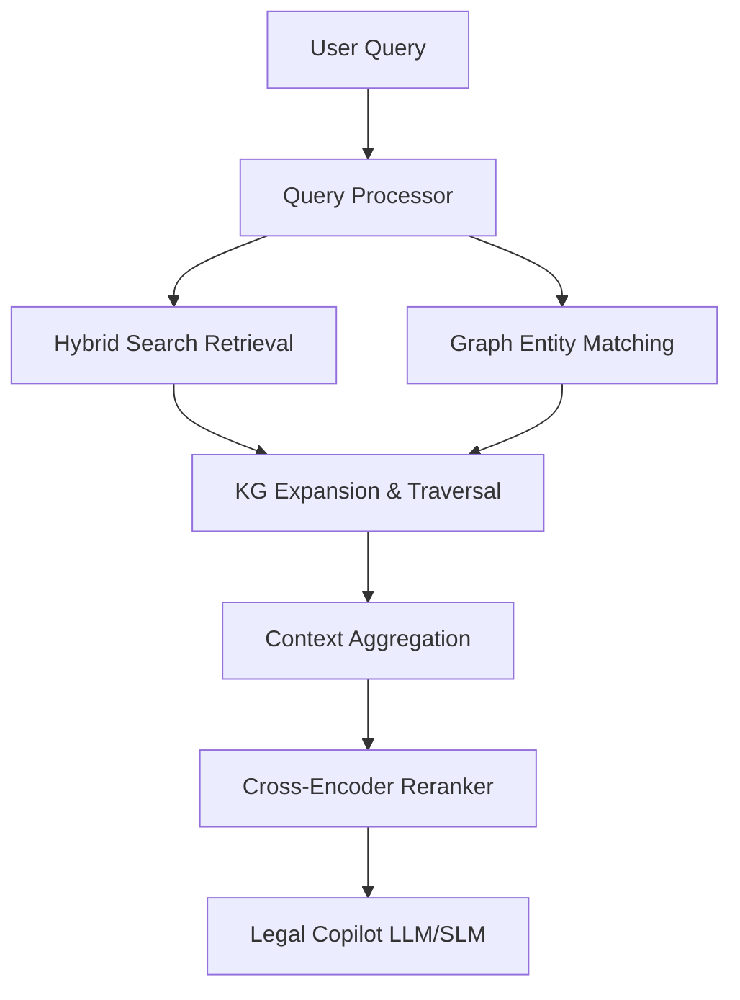
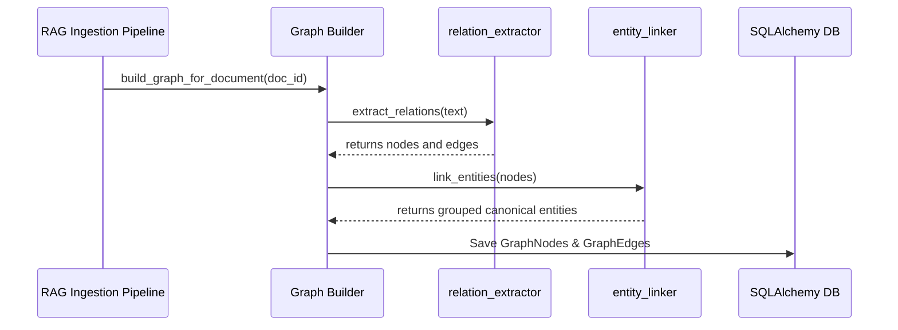

# Implementation Plan: Sprint 3.3 - Enterprise Knowledge Graph Intelligence

This document details the architecture, schemas, pipelines, and algorithms to implement **Sprint 3.3: Enterprise Knowledge Graph Intelligence** as a portable reasoning layer on top of RedactAI's existing RAG search systems.

---

## 1. Enterprise Knowledge Graph Architecture

The Knowledge Graph functions as a relational metadata index and entity linkage layer. During retrieval, queries trigger semantic checks alongside graph neighbor traversals to pull associated context before ranking.



---

## 2. Graph Data Model

### Node Types
- `Document`: Canonical root representing the imported contract/file.
- `Section`: Structured chapters/headings.
- `Clause`: Legal commitments and commitments types (e.g. Indemnity, Term).
- `Paragraph`: Raw text chunk sequences.
- `Entity`: Generic matched tokens.
- `Person` / `Organization` / `Location`: Extracted NER categories.
- `Law` / `Regulation`: Governing statutes (e.g., DPDP Act 2023, RBI guidelines).
- `Obligation` / `Risk`: Extracted regulatory commitments or exposure metrics.
- `Timeline Event`: Milestones, notices, dates.

### Edge Types (Relationships)
- `PARENT_OF`: Parent-child structural layout hierarchy.
- `NEXT_SECTION`: Linear reading sequences of headings.
- `REFERS_TO` / `MENTIONS`: Entities linked to specific paragraphs.
- `BELONGS_TO`: Association to a specific contract/document.
- `CITES`: Cross-document or cross-clause references.
- `DEPENDS_ON`: Contractual precedence rules.
- `AMENDS`: Modifying clauses.
- `RELATED_TO` / `PART_OF`: Generic entity connections.

---

## 3. Folder Structure

We will add the following files to support Sprint 3.3:
```text
backend/
├── models/
│   └── graph.py                  # [NEW] GraphNode & GraphEdge schemas
├── services/
│   └── legal_ai/
│       ├── graph_builder.py      # [NEW] Pipeline assembling elements during indexing
│       ├── graph_traversal.py    # [NEW] BFS, DFS, PPR traversals (NetworkX engine)
│       └── graph_analytics.py    # [NEW] Closeness stats & community detection
└── api/
    └── v1/
        └── graph.py              # [NEW] Graph endpoints (query, statistics, traversal)
frontend/
└── app/
    └── dashboard/
        └── graph/
            └── page.tsx          # [NEW] Graph visualization dashboard
```

---

## 4. Database Schema

The graph is persisted using two tables in the relational database, fully isolated by organization limits:

```sql
CREATE TABLE graph_nodes (
    id UUID PRIMARY KEY,
    organization_id UUID NOT NULL REFERENCES organizations(id) ON DELETE CASCADE,
    node_type VARCHAR(50) NOT NULL,
    label VARCHAR(255) NOT NULL,
    properties JSON,
    created_at TIMESTAMP WITH TIME ZONE DEFAULT timezone('utc', now()),
    updated_at TIMESTAMP WITH TIME ZONE DEFAULT timezone('utc', now())
);

CREATE TABLE graph_edges (
    id UUID PRIMARY KEY,
    organization_id UUID NOT NULL REFERENCES organizations(id) ON DELETE CASCADE,
    source_node_id UUID NOT NULL REFERENCES graph_nodes(id) ON DELETE CASCADE,
    target_node_id UUID NOT NULL REFERENCES graph_nodes(id) ON DELETE CASCADE,
    relationship_type VARCHAR(50) NOT NULL,
    weight FLOAT NOT NULL DEFAULT 1.0,
    properties JSON,
    created_at TIMESTAMP WITH TIME ZONE DEFAULT timezone('utc', now())
);

CREATE INDEX idx_graph_nodes_org ON graph_nodes(organization_id);
CREATE INDEX idx_graph_edges_org ON graph_edges(organization_id);
CREATE INDEX idx_graph_edges_source ON graph_edges(source_node_id);
CREATE INDEX idx_graph_edges_target ON graph_edges(target_node_id);
```

---

## 5. Graph Construction Pipeline

The construction pipeline runs automatically at the end of document ingestion. It reuses existing NLP engines to extract and store nodes/edges.



---

## 6. Traversal Algorithms

We will load subgraphs matching the current user's organization boundary into `networkx.DiGraph` for execution:
- **BFS (Breadth First Search)**: Expand layer-by-layer up to `max_depth` to capture adjacent context.
- **DFS (Depth First Search)**: Trace deep paths to discover transitive dependencies (e.g., Clause A -> cites Clause B -> cites Act C).
- **Personalized PageRank (PPR)**: Measure node importance relative to start query entities to sort contextual relevance.
- **K-Hop Neighborhood Expansion**: Pull all nodes within $K$ hops of matching query tokens.

---

## 7. Retrieval Integration

When a user chats with the Copilot, graph expansion runs as a reasoning step before reranking:
1. **Query Entity Search**: Match query keywords to `GraphNode` records.
2. **K-Hop Traversal**: Traverse the matched nodes to pull associated sections, clauses, and regulations.
3. **Context Injection**: Append the matched graph nodes and relationship summaries into the context sent to the Reranker and LLM.

---

## 8. API Specification

- `GET /api/v1/graph/entities`: Paginated list of nodes.
- `GET /api/v1/graph/entity/{id}`: Detailed properties of a node.
- `GET /api/v1/graph/relationships`: Paginated list of edges.
- `GET /api/v1/graph/document/{id}`: Subgraph nodes for a specific document.
- `POST /api/v1/graph/query`: Search nodes matching text.
- `POST /api/v1/graph/traverse`: Trigger BFS/DFS/PPR from a start node.
- `GET /api/v1/graph/statistics`: Summary statistics (Node counts, Edge counts, community sizes).

---

## 9. Dashboard Design

The Graph Visualization dashboard will be built under `frontend/app/dashboard/graph/page.tsx` using a lightweight client-side network renderer (e.g., SVG-based canvas or a responsive visualization component):
- **Controls**: Zoom, Pan, Search node, filters for node types and edge relations.
- **Node Colors**: Distinct color classes based on `node_type`.
- **Node Actions**: Double-click to expand neighbors, click to show document preview.
- **Layout**: Dynamic force-directed layout.

---

## 10. Security & Privacy Review
- **Organization Boundaries**: Enforced at the SQL query level: `organization_id == current_user.organization_id` is appended to all graph queries.
- **No Leaks**: Subgraph generation and NetworkX load checks explicitly exclude foreign tenant records.

---

## 11. Performance Review
- **Graph Caching**: NetworkX instances are cached in memory using TTL cache decorators, cleared whenever new documents are indexed.
- **Lazy Loading**: Traversal endpoints return nodes and edges as needed, avoiding loading the entire network on initial dashboard mount.

---

## 12. Traversal & Integration Risks
- **Cycle Handling**: BFS and NetworkX traversals natively prevent infinite loops using visited checks.
- **Large Graphs**: Traversal depth limits (default `max_depth = 2`) avoid performance degradation on large datasets.

---

## 13. Testing Strategy
We will implement tests in `backend/tests/test_graph.py` verifying:
- Graph construction for sample contracts using `relation_extractor`.
- Traversal metrics (BFS, DFS, PPR correctness).
- Verification of strict tenant isolation between Org A and Org B.
- API schema validation.
